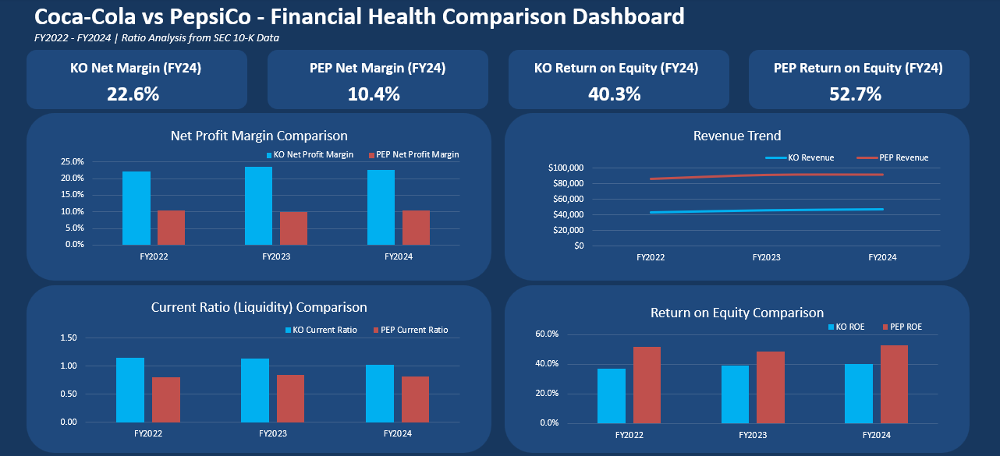

# Coca-Cola vs. PepsiCo — Financial Statement Ratio Analysis

## Business Question
Which company — Coca-Cola (KO) or PepsiCo (PEP) — has the stronger financial position, and how should an investor weigh profitability against leverage and liquidity when comparing them?

## Data Source
[SEC EDGAR](https://www.sec.gov/edgar/search/) — 10-K filings for both companies, FY2022–FY2024:
- Coca-Cola: [FY2024 10-K](https://www.sec.gov/Archives/edgar/data/21344/000002134425000011/ko-20241231.htm)
- PepsiCo: [FY2024 10-K](https://www.sec.gov/Archives/edgar/data/77476/000007747625000007/pep-20241228.htm)

## Method
Built entirely in Excel, no external tools. Structure:
- `KO Data` / `PEP Data` — raw financial statement line items (Revenue, Net Income, Total Assets, Current Assets, Total Liabilities, Current Liabilities, Total Equity)
- `Ratio Analysis` — 9 ratios per company, all live formulas referencing the Data tabs: Current Ratio, Working Capital, Debt-to-Equity, Debt Ratio, Net Profit Margin, Asset Turnover, Equity Multiplier, ROA, ROE
- `Chart Source` — a small formula-driven table feeding the Dashboard's KPI cards and charts
- `Dashboard` — 4 KPI cards (FY2024 snapshot) + 4 charts (Net Profit Margin, Revenue Trend, Current Ratio, ROE), each comparing KO vs. PEP across all three years
- `Recommendation` — written investment view built using DuPont decomposition (ROE = Net Profit Margin × Asset Turnover × Equity Multiplier)

**Methodology note:** ROE is calculated as Net Income attributable to shareowners ÷ Total Equity (including noncontrolling interests). This creates a small numerator/denominator mismatch, but noncontrolling interests represent a small share of total equity for both companies, so the effect on ROE is minor. This convention is consistent with how most financial data providers (e.g., Yahoo Finance) calculate ROE.

## Key Findings
- **KO is meaningfully more profitable per sales dollar**: Net Profit Margin of 22.2%–23.4% across FY2022–FY2024, versus PEP's 9.9%–10.4%
- **PEP's Return on Equity is higher than KO's (40.3%–52.7% vs. 36.9%–40.3%), but this is not a pure performance story.** Using DuPont decomposition, PEP's advantage comes from a combination of better Asset Turnover and significantly higher leverage (Equity Multiplier ~5.3–5.5x vs. KO's ~3.6–3.8x) — not from superior operating profitability
- **KO carries a stronger liquidity position**: Current Ratio consistently above 1.0, versus PEP's Current Ratio below 1.0 and negative Working Capital in all three years, meaning PEP relies on incoming cash flow rather than existing short-term assets to meet obligations
- **Bottom line**: the choice between KO and PEP is a risk-tolerance tradeoff, not a clear-cut "better company." KO offers stronger margins and a more conservative balance sheet; PEP offers a higher ROE at the cost of more leverage and thinner liquidity

## Files
- `KO_PEP_Ratio_Analysis.xlsx` — the full workbook (Dashboard, Ratio Analysis, Chart Source, Recommendation, KO Data, PEP Data)
- Dashboard screenshot used for the LinkedIn post

## What I'd Do Next
- Extend the analysis with valuation ratios (P/E, EV/EBITDA) to move from "which company is healthier" to "which company is more fairly priced" — this sets up Project 7 (DCF valuation)
- Add a 5-year lookback to test whether the Central-margin-style gap (KO's profitability advantage, PEP's leverage-driven ROE) is a structural pattern or a recent shift
- Rebuild the same comparison using Python (pandas) pulling data via an API, to compare manual 10-K extraction against an automated pipeline
